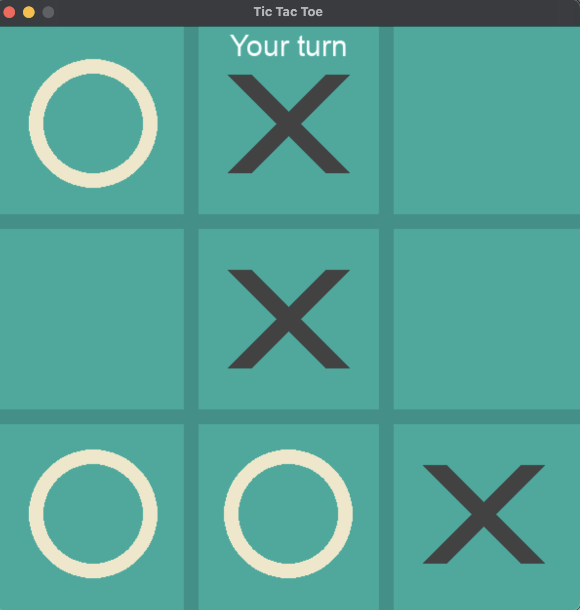
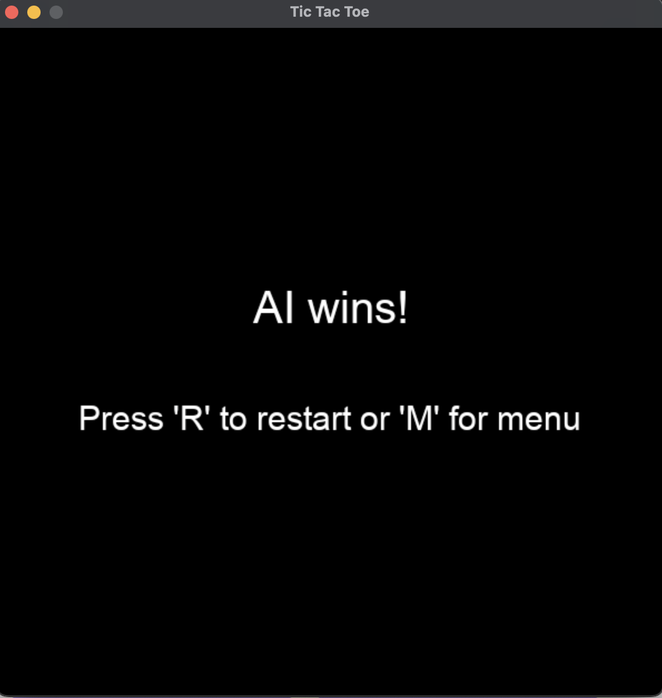

# Tic-Tac-Toe Game

A Python implementation of the classic Tic-Tac-Toe game using Pygame.


## Created with Amazon Q CLI

This entire game was created using Amazon Q CLI without writing any code manually. The complete implementation was generated through natural language prompts, demonstrating the power of AI-assisted development.

## Features

- **Game Modes**:
  - Player vs Player: Two human players take turns
  - Player vs AI: Challenge the computer opponent

- **Smart AI**:
  - Strategic decision making
  - Prioritizes winning moves and blocking opponent wins
  - Follows optimal Tic-Tac-Toe strategy

- **User Interface**:
  - Clean, modern design
  - Game state indicators
  - Winner declaration
  - Restart and menu navigation options

## How to Play

1. Run the game: `python tictactoe.py`
2. Select a game mode from the menu
3. In Player vs Player mode, players take turns placing X and O
4. In Player vs AI mode, you play as X against the computer
5. First to get three in a row (horizontally, vertically, or diagonally) wins

## Controls

- **Mouse**: Click to place your mark or select menu options
- **R key**: Restart the current game
- **M key**: Return to the main menu

## Requirements

- Python 3.x
- Pygame library

## Installation

```bash
pip install pygame
```

## Development Process

This project showcases how complex applications can be built using AI:
- The entire codebase was generated by Amazon Q CLI
- No manual coding was required
- Features were added incrementally through conversation
- Bug fixes and improvements were made through natural language requests

## Screenshots





